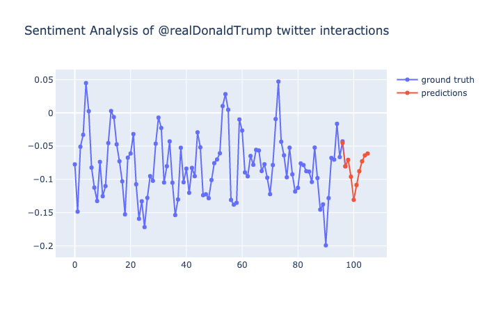
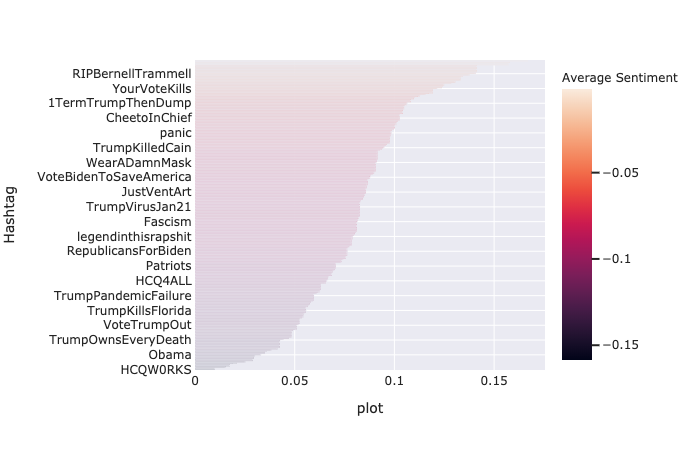

# Predictweet

Este proyecto consiste en una API que extrae datos de un usuario de Twitter.Analiza la positividad y negatividad de las reacciones al usuario y a los hashtags. POr último, predice cómo va a cambiar la positividad y negatividad a través de machine learning.
 
## Métodos usados:
Extraer datos ==> Twitter API                  
Análisis de sentimientos ==> Vader     
Predicción reacciones  ==>  AR     
Sacar hashtags de las respuestas   ==>  Regex  
Gráficos  ==>  Plotly    
Crear la API  ==>  FastAPI  

#### Extracción de datos  
Se extraerán 100 tweets del usuario elegido, por cada uno de esos 100 tweets se extraerán 100 respuestas (a través del tweet id).     

#### Análisis de sentimientos
Tras probar con NLTK, y Textblob, los sentimientos de las respuestas se extraerán con Vader.    

#### Predicción de análisis de sentimientos
Tras probar con varios modelos, ARMA, ARIMA y Autoreg quedan descartados y se usará AR.  

#### Resultados

